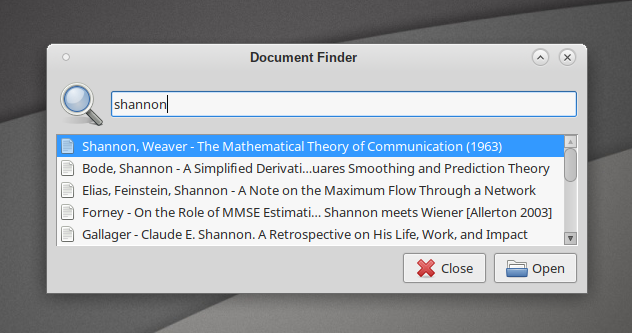

# dof

**dof** is a minimalist document finder inspired by [Xfce4 Application Finder](http://docs.xfce.org/xfce/xfce4-appfinder/start). It is written in [Python3](http://www.python.org/) and uses [PyQt5](http://www.riverbankcomputing.com/software/pyqt/).
Currently Linux only.



## Installation

```sh
git clone https://github.com/rwnobrega/dof.git
pip install .
```

## Configuration

dof calls `ls` on each line of the file `.config/dof/dof.cfg`. It ignores lines starting with `#`. Example:

```conf
# dof configuration file
$HOME/Biblio/{Books,Papers,Theses}/*.{pdf,djvu}
$HOME/Comics/*/*.cbr
```
